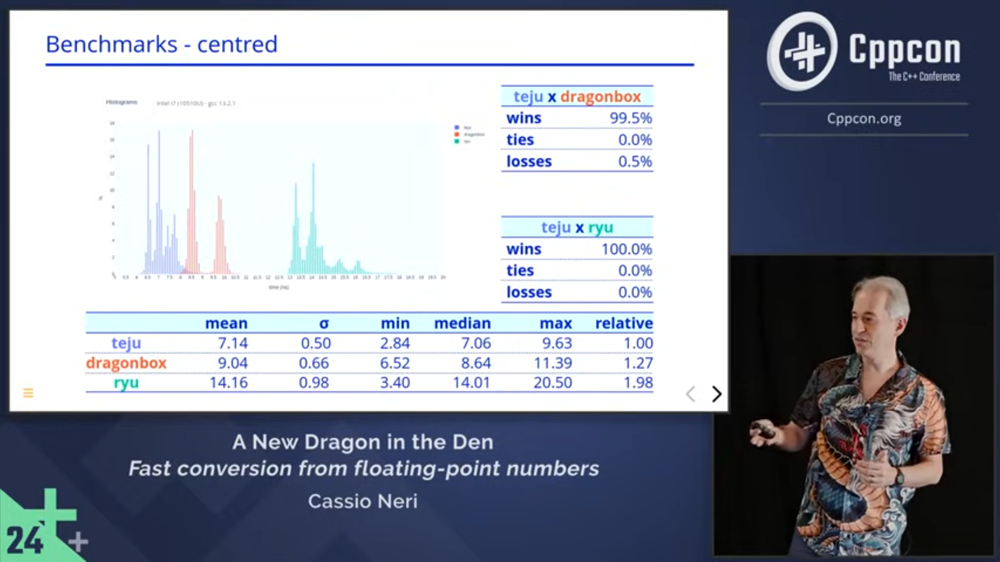

# Tejú Jaguá

## Work in Progress


## Description

This repository contains the reference implementation of Tejú Jaguá, a partial (see below) algorithm for converting floating-point numbers to string.

The main function is `teju_function` in `teju/teju.h`.
It is written in C, the *lingua franca* of programming languages, making the code accessible to a large number of programmers.
The implementation for each floating-point type is parameterised on the characteristics of the type.
The parameters are provided as entities (*e.g.*, macros) that must be defined before `teju/teju.h` is `#include`d.
Even the function name, `teju_function`, is a macro to ensure that there are different symbols for different floating-point types.

Their definitions are created by an external program, the _generator_, written in C++ in `cpp/generator`.
The generated files `#include` `teju/teju.h`.
For the most common IEEE-754 types the generated files are checked in `teju/generated`.
The input for the generator is a config JSON file describing the floating-point type and details of the platform/implementation.
Again, for the most common IEEE-754 types, config files are checked in `config`.

Tejú Jaguá only performs the main step of the conversion.
Indeed, converting a floating-point value `x` (*e.g.*, -10,000,000,000) into a string can be split into the three following steps.
1. Decoding the bit pattern of `x` into its sign, exponent and mantissa of *the binary representation* (-9,765,625 x 2¹⁰).
2. Finding the *shortest-information-preserving* decimal representation (1 x 10¹⁰) of the absolute value of the binary representation.
3. Converting the sign, decimal mantissa and decimal exponent into strings (`"-"`, "`1`", `"10"`) and assemble them to form the final result (`"-1e10"`).
Tejú Jaguá, *i.e.* `teju_function`, only performs step 2 but this repository also provides implementations of step 1 for the most common IEEE-754 floating-point types.
No implementation for step 3 is provided (yet).

An academic paper will be written to provide proof of correctness.

This work has been presented at [C++ Now 2024](https://www.youtube.com/watch?v=w0WrRdW7eqg),
[C++ on Sea 2024](https://www.youtube.com/watch?v=cEDo44i9imU)
and [CppCon 2024](https://www.youtube.com/watch?v=fPZ1ZdA7Iwc).

[](https://www.youtube.com/watch?v=fPZ1ZdA7Iwc)

## Table of Contents

**[Building with CMake](#building-with-cmake)**<br>

  * **[Command line](#command-line)**
  * **[Visual Studio IDE](#visual-studio-ide)**
  * **[Dependencies](#dependencies)**

**[Executables](#executables)**<br>

# Building with CMake

A set of CMake presets is available. For instance, on Linux the preset
`gcc.debug.make` builds in `debug` mode using `gcc` and `make`. On Windows
`msvc.debug.ninja` builds in `debug` mode using `msvc` and `ninja`. In general,
preset names have the form *compiler*.*mode*.*builder* where

* *compiler* is one of `clang` (Linux), `clang-cl` (Windows), gcc (Linux) or
`msvc` (Windows);
* *mode* is one of `debug`, `release` or `release-symbols`;
* *builder* is one of `make` (Linux) or `ninja`.

## Command line

Tip: `cmake --list-presets` shows the complete list of available presets for your platform.

To build everything, on the top level directory, run:
```
$ cmake --preset <preset-name>
$ cmake --build build/<preset-name>
```

## Visual Studio IDE

Make sure you have the
[cmake](https://learn.microsoft.com/en-us/cpp/build/cmake-projects-in-visual-studio?view=msvc-170)
tools installed and, optionally,
[clang](https://learn.microsoft.com/en-us/cpp/build/clang-support-msbuild?view=msvc-170)
tools if you wish to build with `clang-cl`. Simply open the top level
folder and select one of the available presets.

### Dependencies

During the configuration phase, CMake creates folder `third-party` where it downloads specific versions of third-party dependencies:
* [Dragonbox](https://github.com/jk-jeon/dragonbox)
* [Ryu](https://github.com/ulfjack/ryu)
* [GoogleTest](https://github.com/google/googletest)
* [Nlohmann JSON](https://github.com/nlohmann/json)
* [Boost Multiprecision](https://github.com/boostorg/multiprecision)
* [Nanobench](https://github.com/martinus/nanobench)

Dragonbox and Ryu are alternative algorithms for converting floating-point numbers into strings.
They are used, alongside GoogleTest, for testing (checking that Tejú Jaguá produces the same results as the alternatives.)
The generator uses Nlohmann JSON to read the config files and Boost Multiprecision to calculate constants required by Tejú Jaguá.
Nanobench is used to benchmark Tejú Jaguá, Dragonbox and Ryu.

# Executables

The build creates three executables in `build/<preset-name>/bin`: `generator`, `benchmark` and `test`.

## Generator

## Benchmark

## Test
